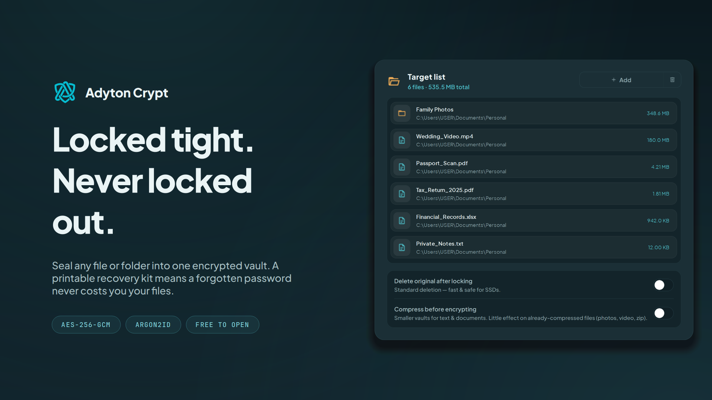

<p align="center">
  
</p>

<h1 align="center">Adyton Crypt</h1>

<p align="center">
  Lock any file or folder into a sealed vault — with a way back in if you forget the password.
  <br>
  <strong><a href="https://github.com/ahmadellatos/adyton-crypt-releases/releases/latest">Download for Windows</a></strong>
</p>

---

Anyone can encrypt a folder. The hard part is being sure you can open it again.

Adyton Crypt locks any file or folder into a single sealed vault that only you can open.
Right-click a folder, set a password, done. But it also does the thing most encryption tools
refuse to do: it gives you a way back in. Every vault can carry a recovery code and a
printable recovery kit, plus an optional password hint. Forget your password and you have
not lost your files.

Real encryption, not a folder that hides — AES-256 with Argon2id, running entirely on your
own PC. Nothing is uploaded, and no server anywhere holds a copy. Which means you decide
where the vault lives: your PC, a USB drive, or your own OneDrive or Dropbox. It travels as
a locked box nobody else can read.

**Opening a vault is free. Permanently, in every version.** Not a trial, not the first three
files. Whatever you decide about paying, and whatever happens to us, you can always get your
files back out.

## Free vs Pro

Everything below is **Free**, with no limits:

- Turn any file or folder into a sealed vault, straight from the right-click menu
- Recovery code, printable recovery kit, and password hint
- Test a vault to confirm it opens before you rely on it
- Lock private notes and text, not just files
- Securely erase the original after locking it away
- Keep your vault anywhere — PC, USB, or your own cloud
- Auto-clear the clipboard and lock on idle
- Light and dark themes, English and Indonesian

A one-time **Pro** unlock adds Windows Hello unlock, keyfile two-factor protection,
opening a vault to extract only the files you need, locking several files at once, and
optional compression. No subscription, ever.

## Install

Download the latest installer from the
[Releases page](https://github.com/ahmadellatos/adyton-crypt-releases/releases/latest) and
run it. Windows 10 or 11, 64-bit.

Also on the [Microsoft Store](https://apps.microsoft.com/detail/9NZCK5G5X6FP), which handles
updates for you automatically.

### About the SmartScreen warning

The installer here is not code-signed yet, so Windows will show
**"Windows protected your PC"** the first time you run it. That is Windows saying it has not
seen this file before, not that it found anything wrong. Click **More info → Run anyway**, or
install from the Microsoft Store instead, where the package is signed.

You can verify you got the real file — every release lists the installer's SHA-256 hash.
Check yours before running it:

```powershell
Get-FileHash .\Adyton_Crypt_Setup_v1.0.4.exe -Algorithm SHA256
```

## Support

Something broken, or a key you need resent? **support.adytoncrypt@gmail.com** — a real
person answers.

- [Privacy policy](https://gist.github.com/ahmadellatos/41f471597143e3149345cb189e0b4c79) — short version: nothing about you is collected.

---

<sub>This repository hosts downloads only; Adyton Crypt's source is not public. © 2026 Adyton Labs.</sub>
